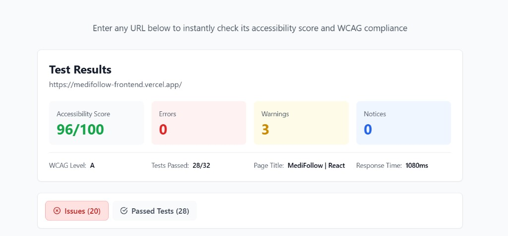
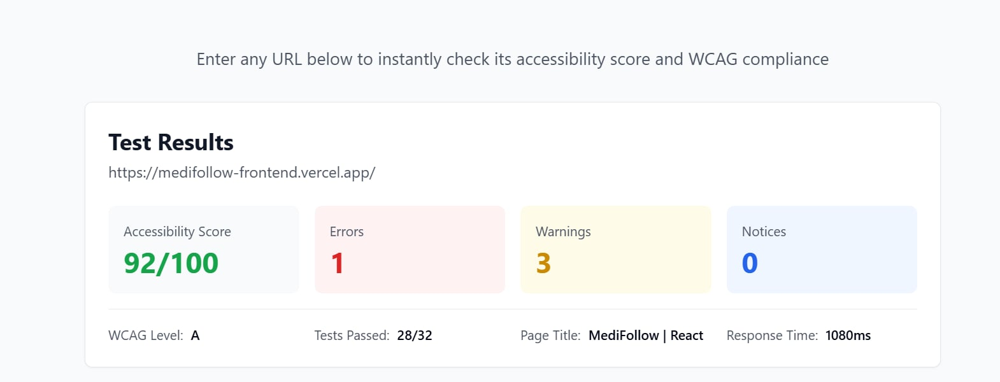
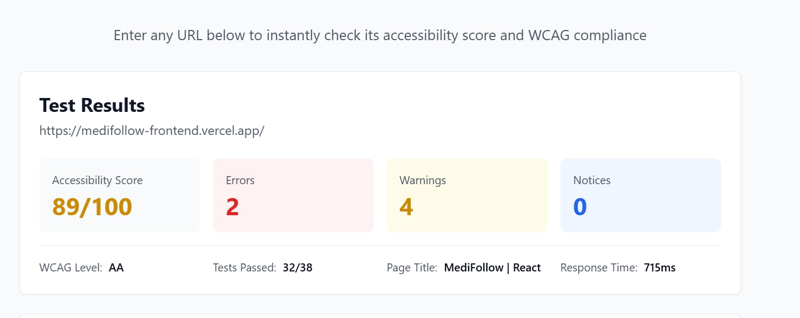

# Accessibility Audit (WCAG) — MediFollow

**Project:** MediFollow — Patient follow-up platform (CHU Abdelhamid Ben Badis)  
**Stack:** React 18 + Vite 5 + Bootstrap 5 (xray theme) + NestJS  
**Analyzed URL:** `https://medifollow-frontend.vercel.app/`  
**Report date:** April 29, 2026  
**Author:** CodeCraft Team  

---

## Executive summary — Automated scans (achecker.ca)

This report documents an **automated first pass** using **[achecker.ca](https://achecker.ca/)**. **Automated scans alone do not prove legal WCAG conformance** — human review remains required.

### Visual results (screenshots)

URL tested: `https://medifollow-frontend.vercel.app/`.

| WCAG **Level A** — **96 / 100**, **0** errors, **3** warnings | WCAG **Level A** — **92 / 100**, **1** error, **3** warnings |
|---|---|
|  |  |

| WCAG **Level AA** — **89 / 100**, **2** errors, **4** warnings — **32 / 38** tests |
|---|
|  |

Detailed metrics are in the summary table below.

### Summary table

| Metric | WCAG **Level A** (after fixes) | WCAG **Level AA** |
|--------|-------------------------------------|---------------------|
| **Accessibility score** | **96 / 100** (best run) | **89 / 100** (example) |
| **Errors** | **0** | **2** |
| **Warnings** | **3** | **4** |
| **Notices** | **0** | **0** |
| **Tests passed** | **28 / 32** | **32 / 38** |
| **Page title** | MediFollow \| React | Same |

**Brief interpretation:** **Level A** shows a strong result after fixing the footer link (WCAG 1.4.1). **Level AA** adds stricter rules — hence additional errors and warnings to address separately.

---

## 1. Context and scope

**Objective:** document compliance target (**A** / **AA**), list automated findings, and record **corrective measures** in code.

- **In scope:** public landing and `LandingShell` wrapper (navbar, footer).
- **Out of scope:** full authenticated application (to be audited on critical routes).

### Recommended tools (assignment brief)

| Tool | Role |
|------|------|
| [achecker.ca](https://achecker.ca/) | Quick scan, score |
| **axe DevTools** | Detailed DOM analysis |
| **WAVE** | Visual highlighting |
| **Lighthouse** (Accessibility category) | Lab audit |

---

## 2. Methodology

1. URL: `https://medifollow-frontend.vercel.app/`
2. **Level A** and **Level AA** configurations on achecker.ca, desktop view.
3. Known issue fixed: text link “MediFollow” (footer) — distinguished only by color (**1.4.1**).

---

## 3. WCAG levels (reference)

| Level | Typical use |
|-------|-------------|
| **A** | Minimum baseline |
| **AA** | Common target (contrast 1.4.3, etc.) |
| **AAA** | Rarely required |

**Declared status (automated only):** **Level A** is favorable on the best scan; **Level AA** — address remaining errors and follow up with manual review.

---

## 4. Issue addressed — “MediFollow” link (copyright)

| Field | Detail |
|-------|--------|
| **Symptom** | Link not distinguishable without color (`text-decoration-none` + `text-primary`). |
| **WCAG** | **1.4.1 Use of Color** (A). |
| **Fix** | Class `landing-footer-home-link` + CSS in `public/hospital/css/style.css`: underline `!important`, `:focus-visible`. |
| **Files** | `Front_End/CODE-REACT/src/components/landing/LandingShell.jsx`, `public/hospital/css/style.css`. |

---

## 5. Remaining items (AA) and next steps

| Priority | Action |
|----------|--------|
| **P0** | Fix the **2 errors** listed in the **AA** scan (Issues tab). |
| **P1** | Address **warnings** or document false positives. |
| **P2** | Full keyboard pass; NVDA / VoiceOver on a sample. |
