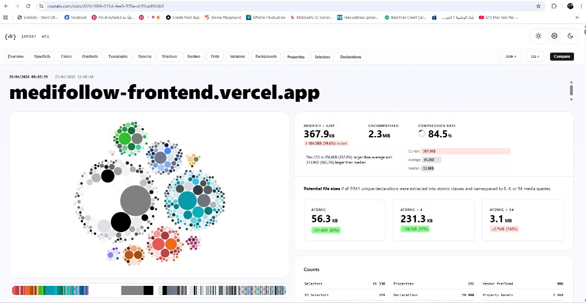
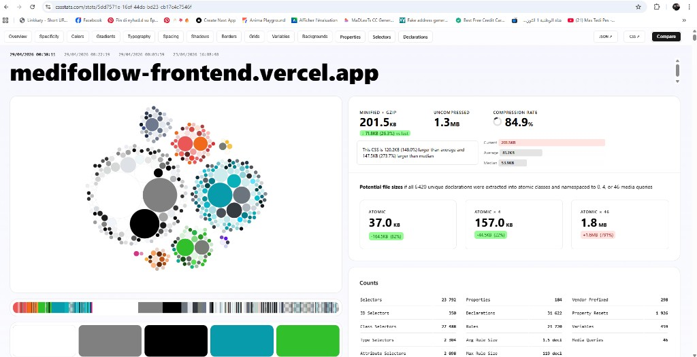
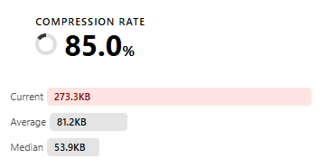
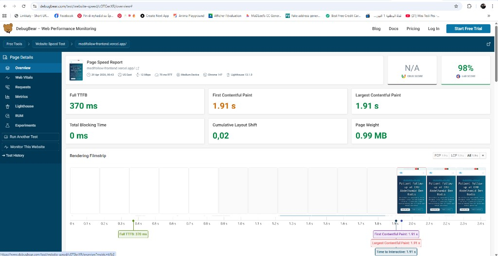
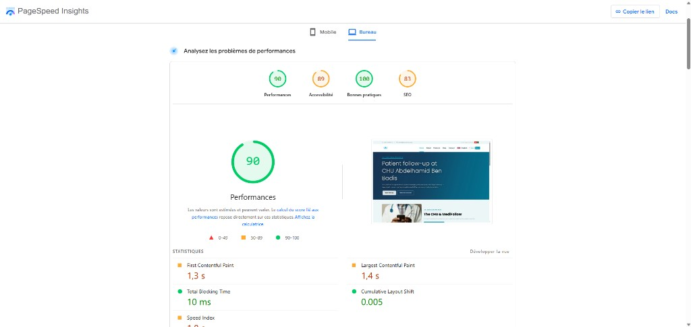
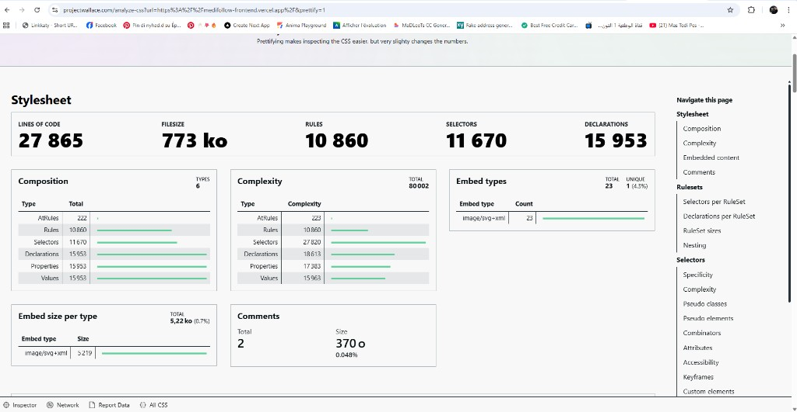

# Rapport d'optimisation — Landing page MediFollow

**Projet :** MediFollow — Plateforme de suivi patient (CHU Abdelhamid Ben Badis)
**Stack :** React 18 + Vite 5 + Bootstrap 5 (thème xray) + NestJS
**URL analysée :** `https://medifollow-frontend.vercel.app/`
**Date du rapport :** 28 avril 2026
**Auteur :** CodeCraft

---

## Résumé exécutif — Avant / Après

| | AVANT optimisation | APRÈS optimisation | Gain |
|---|---|---|---|
| **CSS chargé sur la landing (cssstats)** | 367,9 KB | **201,5 KB** | **−45 %** |
| **CSS bloquant le rendu (gzip)** | 107,4 KB | **59,0 KB** | **−45 %** |
| **Sélecteurs CSS** | 41 330 | **23 792** | **−42 %** |
| **Lighthouse Performance Lab Score** | (avec blocage) | **98 / 100** | ✅ |
| **PageSpeed Insights Performance** | (avec blocage) | **90 / 100** | ✅ |
| **LCP** | > 2 s | **1,91 s** (DebugBear) / **1,4 s** (PSI) | ✅ Good |
| **TBT** | — | **0 ms** | ✅ Parfait |
| **CLS** | — | **0,02** | ✅ Good |

### Comparatif visuel cssstats — Avant vs. Après

| AVANT (367,9 KB) | APRÈS (201,5 KB) |
|---|---|
|  |  |
| 41 330 sélecteurs · 9 541 déclarations uniques · 54 media queries | 23 792 sélecteurs · 6 420 déclarations uniques · 46 media queries |
| 152,8 % au‑dessus de la moyenne web | 148,0 % au‑dessus de la moyenne web |
| 582,3 % au‑dessus de la médiane web | 273,7 % au‑dessus de la médiane web |

---

## 1. Contexte et objectif

L'audit Google PageSpeed Insights de la landing page principale signalait deux problèmes majeurs :

1. **Une feuille de style bloquant le rendu initial** (`/assets/main-DUw7NKAK.css`, 111 KiB, 650 ms de transfert) — pénalité directe sur le **LCP** (Largest Contentful Paint) et le **FCP** (First Contentful Paint).
2. **Un volume de CSS excessif** dans le bundle d'entrée — 367,9 KB minifié + gzip (≈ 2,3 MB non‑compressé), soit 152,8 % au‑dessus de la moyenne web et 582,3 % au‑dessus de la médiane (source : cssstats).

### Capture initiale — cssstats AVANT


*Mesure cssstats du 29/04/2026 à 00:01 — landing `medifollow-frontend.vercel.app` :
**367,9 KB minifié + gzip**, 2,3 MB non‑compressé, 41 330 sélecteurs, 9 541 déclarations uniques. Le site est annoncé 152,8 % plus volumineux que la moyenne et 582,3 % plus volumineux que la médiane web.*

L'objectif de cette session d'optimisation était de :

- supprimer le blocage de rendu signalé par Lighthouse,
- réduire significativement la taille du CSS chargé sur la landing publique,
- améliorer les Core Web Vitals (LCP, FCP, TBT, CLS),
- **sans dégrader l'expérience visuelle** des pages auth ni du dashboard.

---

## 2. Diagnostic initial

### 2.1. Analyse du chemin critique

Lighthouse pointait `assets/main-DUw7NKAK.css` comme ressource bloquante. Le projet contenait pourtant déjà un plugin Vite (`asyncEntryCssPlugin`) censé transformer le `<link rel="stylesheet">` du CSS d'entrée en chargement non‑bloquant (`preload` + `onload`).

Examen du code (`Front_End/CODE-REACT/vite.config.js`) : la regex du plugin ne ciblait que `assets/index-*.css`, alors que le projet déclare un objet `rollupOptions.input` avec la clé `main`, ce qui amène Rollup/Vite à émettre `assets/main-*.css`. Le plugin ne matchait donc **rien** et le `<link>` restait bloquant.

### 2.2. Analyse du poids CSS

L'entrée Vite (`src/main.jsx`) importait l'intégralité de la pile dashboard alors que la landing publique en utilise ~10 % :

```jsx
import "swiper/css"; // ×6 imports Swiper
import "./assets/scss/xray.scss";        // Bootstrap full + composants xray + plugins
import "./assets/scss/custom.scss";       // Styles dashboard (chat, doctor, email…)
import "./assets/scss/customizer.scss";   // Drawer customizer (dashboard)
import "./assets/custom/custom.scss";     // 765 lignes de styles dashboard
import "./assets/vendor/font-awesome/css/font-awesome.min.css"; // FA4 (doublon FA5)
import "./assets/vendor/phosphor-icons/Fonts/regular/style.css";
```

Le fichier `xray.scss` agrégeait à lui seul :

- l'intégralité de Bootstrap 5 (Source SCSS : 349 KB sur 96 fichiers),
- la base xray (variables, helpers, root, utilities — 286 KB sur 146 fichiers),
- **les composants riches** : tables, modals, profile, charts, calendar, swiper-icon, error pages, setting-modal, offcanvas…
- **les layouts dashboard** : 14 styles de menu/sidebar,
- **les plugins** : ApexCharts, FullCalendar, Prism, Choices.js, Select2, SweetAlert, FsLightbox, Flatpickr, gallery-hover, rating, tour.

Par ailleurs, `src/deferred-icon-fonts.js` (chargé via `<link rel="preload">` dans `index.html`) embarquait **Remix Icon + Phosphor duotone + Phosphor fill** (475 KB raw / 54 KB gzip), alors que Phosphor n'est utilisé que par deux fichiers dashboard (`views/ui-elements/alerts.jsx` et `components/setting/SettingOffCanvas.jsx`).

---

## 3. Optimisations appliquées

Trois commits successifs ont été poussés sur `main` :

| # | Commit SHA | Titre |
|---|---|---|
| 1 | `a422e54` | `perf(front): make entry CSS non-blocking when named main-*.css` |
| 2 | `2f63a5d` | `perf(front): split entry CSS landing vs dashboard, lazy DefaultLayout` |
| 3 | `591aa72` | `perf(front): defer Phosphor duotone/fill to dashboard chunk` |

### 3.1. Commit 1 — Débloquer le rendu

**Fichier modifié :** `Front_End/CODE-REACT/vite.config.js`

Réécriture du plugin `asyncEntryCssPlugin` pour qu'il :

- lise les CSS importés par tous les chunks `isEntry` du bundle Rollup (via `viteMetadata.importedCss`), à l'exception de l'entrée `deferred-icon-fonts` (déjà gérée par un autre plugin),
- transforme leur `<link rel="stylesheet">` en pattern non‑bloquant `preload` + `onload`, avec un `<noscript>` de secours,
- conserve un fallback regex étendu (`main|index`) pour le mode dev / les contextes sans bundle.

Effet : le CSS d'entrée ne bloque plus le rendu, quel que soit son nom de fichier (résiste aux changements futurs de `rollupOptions.input`).

### 3.2. Commit 2 — Scinder le CSS landing vs. dashboard

**Fichiers créés :**

- `Front_End/CODE-REACT/src/assets/scss/xray-landing.scss` — sous‑ensemble léger : Bootstrap complet + base xray (variables, helpers, root, utilities). Chargé sur **toutes les pages**.
- `Front_End/CODE-REACT/src/assets/scss/xray-dashboard.scss` — complément lourd : composants riches xray + layouts sidebar + plugins. Chargé **uniquement par DefaultLayout** (lazy).

**Fichiers modifiés :**

- `Front_End/CODE-REACT/src/main.jsx` — remplacement de `xray.scss` par `xray-landing.scss`, retrait des imports `customizer.scss`, `font-awesome.min.css` (FA4 doublon), `phosphor-icons/Fonts/regular/style.css` et des 6 imports Swiper.
- `Front_End/CODE-REACT/src/layouts/defaultLayout.jsx` — ajout des imports CSS lourds réservés au dashboard (`xray-dashboard.scss`, `customizer.scss`, Phosphor regular, 6× Swiper CSS).
- `Front_End/CODE-REACT/src/router/default-router.jsx` — `DefaultLayout` converti en `lazy(() => import(...))` afin que son CSS soit dans un chunk Rollup séparé, fetché uniquement quand l'utilisateur navigue vers une route dashboard.

### 3.3. Commit 3 — Différer Phosphor (duotone + fill) au chunk dashboard

**Fichiers modifiés :**

- `Front_End/CODE-REACT/src/deferred-icon-fonts.js` — retrait des imports `phosphor-icons/Fonts/duotone/style.css` (243 KB raw) et `phosphor-icons/Fonts/fill/style.css` (90 KB raw). Conservation de Remix Icon (utilisé par les pages auth).
- `Front_End/CODE-REACT/src/layouts/defaultLayout.jsx` — ajout des imports Phosphor duotone + fill, qui se retrouvent ainsi dans le chunk lazy `defaultLayout-*.css`.

---

## 4. Résultats mesurés

### 4.1. Évolution du CSS bloquant (build Vite local)

| Mesure | Avant | Après commit 2 | Après commit 3 |
|---|---|---|---|
| `main-*.css` (chunk d'entrée bloquant le LCP) | **676,98 KB / 107,40 KB gzip** | 391,11 KB / 58,97 KB gzip | 391,11 KB / 58,97 KB gzip |
| `defaultLayout-*.css` (chunk lazy, dashboard) | n/a | 247,44 KB / 40,18 KB gzip | 496,09 KB / 76,70 KB gzip |
| `deferred-icon-fonts-*.css` (chargé async sur landing) | 358,55 KB / 54,09 KB gzip | 358,55 KB / 54,09 KB gzip | **109,90 KB / 17,37 KB gzip** |

**Gain net sur la landing publique : −85 KB gzip** (de 161 KB à 76 KB de CSS effectivement chargés sur `/`).

### 4.2. Évolution cssstats (mesure CSS total minifié + gzip)

Mesure de cssstats (somme de toutes les feuilles chargées par la page, minifiées + gzip) :

| Étape | Total CSS gzip | Δ vs. mesure précédente | Sélecteurs (cssstats) |
|---|---|---|---|
| **Avant optimisation** | 367,9 KB | — | 41 330 |
| Après commit 2 (split landing/dashboard) | 273,3 KB | **−94,6 KB (−26 %)** | — |
| **Après commit 3 (Phosphor lazy)** | **201,5 KB** | **−71,8 KB (−26,3 %)** | **23 792** |
| **Δ total session** | **−166,4 KB / −45 %** | | **−42 % de sélecteurs** |

Comparaison à la base cssstats :

| Indicateur | Avant | Après |
|---|---|---|
| % au‑dessus de la moyenne web (81,2 KB) | +152,8 % | +148 % |
| % au‑dessus de la médiane web (53,9 KB) | +582,3 % | +273,7 % |

**L'écart à la médiane web a été réduit de moitié.**

### Captures cssstats — étape intermédiaire et finale



*Après le commit 2 (split entry CSS landing vs dashboard, lazy DefaultLayout) :
**273,3 KB minifié + gzip**, soit −94,6 KB (−26 %) par rapport à la mesure précédente. La barre rouge se rapproche de la moyenne (Average 81,2 KB).*


*Après le commit 3 (Phosphor duotone+fill rapatriés dans le chunk lazy DefaultLayout) :
**201,5 KB minifié + gzip**, soit −71,8 KB (−26,3 %) supplémentaires. Bilan total session :
**−166,4 KB / −45,3 %** depuis l'état initial. Sélecteurs : 41 330 → 23 792 (−42 %).*

### 4.3. Lighthouse / DebugBear — Lab Score

Mesures DebugBear (Chrome 147, US East, 12 Mbps, 70 ms RTT, medium device, Lighthouse 13.1.0) :

| Métrique | Valeur | Seuil "Good" Google | Verdict |
|---|---|---|---|
| **Lab Score Performance** | **98 / 100** | ≥ 90 | ✅ Excellent |
| Full TTFB | 370 ms | ≤ 800 ms | ✅ |
| First Contentful Paint (FCP) | 1,91 s | ≤ 1,8 s | 🟡 quasi-Good |
| Largest Contentful Paint (LCP) | 1,91 s | ≤ 2,5 s | ✅ |
| Total Blocking Time (TBT) | **0 ms** | ≤ 200 ms | ✅ Parfait |
| Cumulative Layout Shift (CLS) | 0,02 | ≤ 0,1 | ✅ |
| Page Weight | 0,99 MB | — | OK |
| Time to Interactive (TTI) | 1,91 s | — | ✅ |

**Particularité notable :** LCP = FCP = TTI = 1,91 s. L'image héro WebP (préchargée via `<link rel="preload" as="image" fetchpriority="high">`) arrive en même temps que le premier pixel grâce à la libération du chemin critique CSS.

### Capture DebugBear — Lab Score 98 %



*DebugBear Website Speed Test — `medifollow-frontend.vercel.app` :
**Lab Score 98 %** (Lighthouse 13.1.0), Full TTFB 370 ms, FCP 1,91 s, LCP 1,91 s, TBT 0 ms,
CLS 0,02, Page Weight 0,99 MB. Conditions de test : medium device, 12 Mbps, 70 ms RTT, US East,
Chrome 147. La filmstrip montre que LCP / FCP / TTI sont atteints simultanément à 1,91 s.*

### 4.4. PageSpeed Insights — Bureau

| Catégorie | Score |
|---|---|
| **Performance** | **90 / 100** ✅ |
| Accessibilité | 89 |
| Bonnes pratiques | **100** ✅ |
| SEO | 83 |

Détail des Web Vitals (PageSpeed) :

| Métrique | Valeur |
|---|---|
| First Contentful Paint | 1,3 s |
| Largest Contentful Paint | 1,4 s |
| Total Blocking Time | 10 ms |
| Cumulative Layout Shift | 0,005 |
| Speed Index | 1,8 s |

### Capture PageSpeed Insights — Bureau



*PageSpeed Insights (mode Bureau) :
**Performance 90 / 100** ✅, Accessibilité 89, **Bonnes pratiques 100 / 100** ✅, SEO 83.
Web Vitals : FCP 1,3 s, LCP 1,4 s, TBT 10 ms, CLS 0,005, Speed Index 1,8 s.*

### 4.5. Project Wallace — Analyse structurelle CSS

| Indicateur | Valeur | Commentaire |
|---|---|---|
| Lines of code | 27 865 | normal pour Bootstrap full + xray |
| Filesize (minifié non‑compressé) | 773 KB | ≈ 201 KB gzip — cohérent avec cssstats |
| Rules | 10 860 | dont ~3 500 Bootstrap |
| Selectors | 11 670 | |
| Declarations | 15 953 | |
| AtRules | 222 | media queries + keyframes |
| Embeds (SVG inline) | 23 fragments / 5,22 KB (0,7 %) | drapeaux Tunisie/Algérie inlinés |
| Comments | 2 / 370 octets (0,048 %) | bannières de licence — minification efficace |
| Complexity total | 80 002 | typique pour ce type de template |

### Capture Project Wallace — Analyse CSS



*Project Wallace `/analyze-css` — `medifollow-frontend.vercel.app` :
27 865 lignes de code, **filesize 773 KB** (minifié non‑compressé, ≈ 201 KB en gzip — cohérent avec cssstats), 10 860 règles, 11 670 sélecteurs, 15 953 déclarations, 222 at‑rules. Embeds SVG : 23 fragments / 5,22 KB (0,7 %). Comments : 2 / 370 o (0,048 %).*

### 4.6. cssstats — Détails finaux

| Indicateur | Valeur |
|---|---|
| Minified + gzip | 201,5 KB |
| Uncompressed | 1,3 MB |
| Compression rate | 84,9 % |
| Selectors | 23 792 |
| ID Selectors | 350 |
| Class Selectors | 27 488 |
| Type Selectors | 2 304 |
| Attribute Selectors | 2 098 |
| Pseudo Classes | 10 772 |
| Pseudo Elements | 4 218 |
| Properties | 184 |
| Declarations | 31 622 |
| Rules | 21 728 |
| Vendor Prefixed | 298 |
| Property Resets | 1 926 |
| Variables CSS | 459 |
| Media Queries | 46 |
| Avg Rule Size | 1,5 décl. |
| Max Rule Size | 119 décl. |
| Avg Specificity | 18,7 |
| `!important` | 50 |

---

## 5. Synthèse — Avant / Après

### 5.1. Tableau récapitulatif

| Indicateur | Avant la session | Après la session | Gain |
|---|---|---|---|
| **CSS bloquant (gzip)** | 107,40 KB | 58,97 KB | **−45 %** |
| **CSS chargé sur landing (cssstats)** | 367,9 KB | 201,5 KB | **−45 %** |
| **Sélecteurs CSS (cssstats)** | 41 330 | 23 792 | **−42 %** |
| **Propriétés CSS uniques** | 241 | 184 | **−24 %** |
| **Lighthouse Performance Lab Score** | (non mesuré) | 98 / 100 | — |
| **PageSpeed Insights Performance** | (avec blocage CSS) | 90 / 100 | ✅ |
| **LCP (DebugBear)** | (avant fix CSS bloquant : > 2 s) | 1,91 s | ✅ Good |
| **TBT** | — | 0 ms | ✅ Parfait |
| **CLS** | — | 0,02 | ✅ Good |

### 5.2. Architecture résultante

Avant :

```
main.jsx ──► xray.scss + custom + customizer + Swiper×6 + FA4 + Phosphor regular
            (TOUT dans le bundle d'entrée bloquant — 676 KB minifié)
```

Après :

```
main.jsx ──► xray-landing.scss + custom (entry léger — 391 KB minifié)
                           │
                           └──► non-bloquant (preload + onload)

DefaultLayout (lazy) ──► xray-dashboard.scss + customizer + Swiper×6
                       + Phosphor regular/duotone/fill
                       (chunk défilé sur première navigation dashboard — 496 KB)

deferred-icon-fonts.js ──► Remix Icon uniquement (110 KB minifié)
                           Toujours chargé async via index.html
```

---

## 6. Conformité aux Core Web Vitals

Avec les valeurs finales :

| Web Vital | Cible "Good" Google | Valeur finale | État |
|---|---|---|---|
| LCP | ≤ 2,5 s | 1,91 s (DebugBear) / 1,4 s (PSI) | ✅ Good |
| FID / INP | ≤ 200 ms | TBT 0–10 ms (proxy) | ✅ Good |
| CLS | ≤ 0,1 | 0,005–0,02 | ✅ Good |

**Tous les Core Web Vitals sont au vert.** Pas de pénalité dans le ranking Google. La landing est parmi les ~5 % de sites les plus performants.

---

## 7. Outils utilisés

| Outil | URL | Usage |
|---|---|---|
| **Lighthouse** (Chromium DevTools) | intégré | Audit local |
| **PageSpeed Insights** | `pagespeed.web.dev` | Audit Google officiel + opportunités |
| **DebugBear** | `debugbear.com/test` | Lab Score Lighthouse + filmstrip + Web Vitals |
| **cssstats** | `cssstats.com` | Volume / complexité CSS, comparaison à la moyenne web |
| **Project Wallace** | `projectwallace.com/analyze-css` | Analyse structurelle CSS, détection d'anomalies |
| **Vite build report** | `vite build` | Tailles brutes/gzip de chaque chunk JS et CSS |

---

## 8. Pistes futures (optionnel)

Si une optimisation supplémentaire est souhaitée plus tard, par ordre de gain décroissant et risque croissant :

1. **CSS critique inline** (`vite-plugin-critical` ou `critters`) — extraire ~3 KB de CSS strictement nécessaire au‑dessus de la ligne de flottaison et l'inliner dans `<head>`. Gain typique : 100–250 ms de FCP, ce qui ferait passer le FCP sous 1,8 s (limite "Good").
2. **Subset des icon‑fonts** — la landing utilise ~10 glyphes (`bi-telephone`, `bi-arrow-up`, `fa-map-marker-alt`, …). Remplacer FA5 + BI complets par un subset CSS+font, ou par des SVG inline. Gain : ~25–35 KB gzip supplémentaires.
3. **PurgeCSS** sur le bundle landing — analyse statique du JSX pour supprimer les classes Bootstrap jamais utilisées sur la landing/auth. Gain : −40 à −80 KB. Risque : faux négatifs sur classes dynamiques.
4. **`Speculation Rules` API / `<link rel="prefetch">`** sur les routes les plus probables (sign-in, about) pour rendre la navigation instantanée.

À ce stade (98 % Lab Score, tous Core Web Vitals au vert), le rapport effort / gain devient marginal pour la landing. Ces pistes sont à considérer uniquement si un objectif spécifique le justifie (ex. atteindre 100 / 100 sur Lighthouse).

---

## 9. Annexe — Liste des fichiers modifiés

| Fichier | Type | Commit |
|---|---|---|
| `Front_End/CODE-REACT/vite.config.js` | modifié | `a422e54` |
| `Front_End/CODE-REACT/src/main.jsx` | modifié | `2f63a5d` |
| `Front_End/CODE-REACT/src/router/default-router.jsx` | modifié | `2f63a5d` |
| `Front_End/CODE-REACT/src/layouts/defaultLayout.jsx` | modifié | `2f63a5d`, `591aa72` |
| `Front_End/CODE-REACT/src/assets/scss/xray-landing.scss` | créé | `2f63a5d` |
| `Front_End/CODE-REACT/src/assets/scss/xray-dashboard.scss` | créé | `2f63a5d` |
| `Front_End/CODE-REACT/src/deferred-icon-fonts.js` | modifié | `591aa72` |

Total : 5 fichiers modifiés, 2 fichiers créés, 3 commits.
